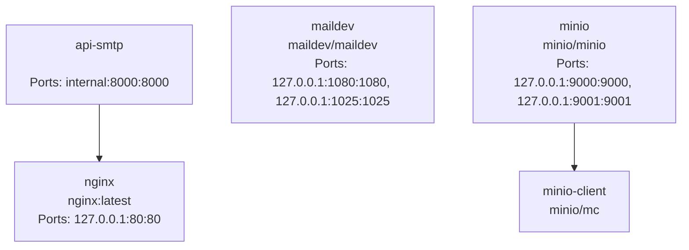
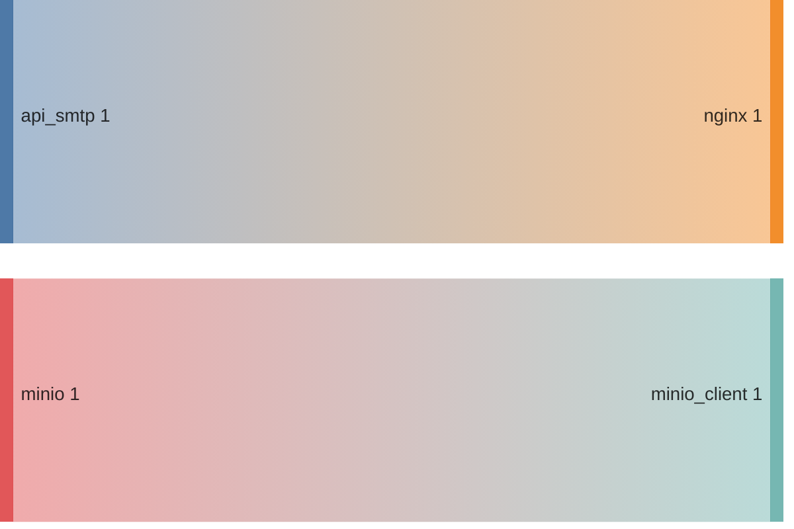
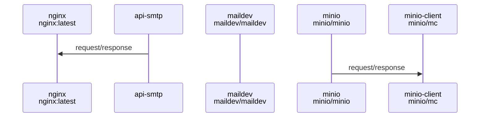

# SMTP Email Sending API

This project is a proof of concept API for sending emails via SMTP, built using FastAPI. It supports both sending emails with and without attachments. The project leverages MinIO for object storage and includes configurations for SMTP settings and API key validation.

## Features

- Send emails via SMTP.
- Support for sending emails with attachments.
- Validation for email fields including recipient email, subject, body, and attachments.
- Uses MinIO for storing attachments.
- Includes API key authentication for secure access.

## Project Structure

```
.
├── docker-compose.yml
├── readme.md
└── src
    ├── app
    │   ├── main.py
    │   ├── requirements.txt
    │   └── smtp_config.json
    ├── docker
    │   └── Dockerfile
    └── nginx
        ├── conf.d
        │   └── default.conf
        └── nginx.conf

5 directories, 8 files
```

## Configuration

The SMTP settings and API key are stored in the `smtp_config.json` file. The structure of this file should be as follows:

```json
{
    "api_key": "your_api_key",
    "api_name": "High-Performance SMTP API",
    "api_description": "SMTP API mail dispatch with support for attachments.",
    "smtp_server": "maildev",
    "smtp_port": 1025,
    "max_len_recipient_email": 64,
    "max_len_subject": 255,
    "max_len_body": 50000,
    "use_ssl": false,
    "use_password": false,
    "use_tls": false,
    "sender_email": "your_email@example.com",
    "sender_domain": "devel.local.email",
    "sender_password": "your_password",
    "minio_server": "minio:9000",
    "minio_access_key": "minioadmin",
    "minio_secret_key": "minioadmin",
    "minio_secure": false
}
```

## Installation

1. Clone the repository:

```bash
git clone https://github.com/exaluc/api-smtp.git
cd api-smtp
```

2. Set up and run Docker containers for MinIO and other dependencies:

```bash
docker-compose up
```

## Usage

### Sending Email with Attachments

Endpoint: `/v1/mail/send-with-attachments`
Method: `POST`
Content-Type: `multipart/form-data`

#### cURL Example

```bash
curl -X 'POST' \
  'http://localhost/v1/mail/send-with-attachments' \
  -H 'accept: application/json' \
  -H 'X-API-Key: your_api_key' \
  -H 'Content-Type: multipart/form-data' \
  -F 'recipient_email=string@dev.local' \
  -F 'subject=Sending mp4 file' \
  -F 'body=<h1>File MP4</h1>' \
  -F 'body_type=html' \
  -F 'debug=false' \
  -F 'attachments=@file.mp4'
```

### Sending Email without Attachments

Endpoint: `/v1/mail/send`
Method: `POST`
Content-Type: `application/json`

#### cURL Example

```bash
curl -X 'POST' \
  'http://localhost/v1/mail/send' \
  -H 'accept: application/json' \
  -H 'X-API-Key: your_api_key' \
  -H 'Content-Type: application/json' \
  -d '{
  "recipient_email": "string@dev.local",
  "subject": "Sending json",
  "body": "Email sended trough api",
  "body_type": "plain",
  "debug": false
}'
```

## API Documentation

API documentation is available at:

- Swagger UI: [http://localhost/docs](http://localhost/docs)
- ReDoc: [http://localhost/redoc](http://localhost/redoc)

## Error Handling

The API handles various SMTP errors and logs the results in JSON files stored under the `data` directory, categorized by date and status (success or failure).

## Contribution

Feel free to open issues or submit pull requests with improvements. Contributions are welcome!

## License

This project is licensed under the MIT License.

## Author

- [Lucian BLETAN](https://github.com/exaluc)

<!-- DOCKUMENTOR START -->

### 🐳 Service: nginx
- **Image**: nginx:latest
- **Ports**: 127.0.0.1:80:80
- **Volumes**: ./src/nginx/nginx.conf:/etc/nginx/nginx.conf:ro, ./src/nginx/conf.d:/etc/nginx/conf.d:ro
- **Depends On**: api-smtp
- **Command**: No command specified
#### Environment Variables

| Variable | Value |
|----------|-------|

### 🐳 Service: api-smtp
- **Image**: 
- **Ports**: internal:8000:8000
- **Volumes**: ./data:/app/data
- **Depends On**: 
- **Command**: No command specified
#### Environment Variables

| Variable | Value |
|----------|-------|
| MODULE_NAME | main |
| VARIABLE_NAME | app |

### 🐳 Service: maildev
- **Image**: maildev/maildev
- **Ports**: 127.0.0.1:1080:1080, 127.0.0.1:1025:1025
- **Volumes**: 
- **Depends On**: 
- **Command**: No command specified
#### Environment Variables

| Variable | Value |
|----------|-------|
| MAILDEV_SMTP_PORT | 1025 |
| MAILDEV_WEB_PORT | 1080 |

### 🐳 Service: minio
- **Image**: minio/minio
- **Ports**: 127.0.0.1:9000:9000, 127.0.0.1:9001:9001
- **Volumes**: 
- **Depends On**: 
- **Command**: server /data --console-address ":9001"
#### Environment Variables

| Variable | Value |
|----------|-------|
| MINIO_ROOT_USER | minioadmin |
| MINIO_ROOT_PASSWORD | minioadmin |

### 🐳 Service: minio-client
- **Image**: minio/mc
- **Ports**: 
- **Volumes**: 
- **Depends On**: minio
- **Command**: No command specified
#### Environment Variables

| Variable | Value |
|----------|-------|


## Networks


## Graphs

### Network depend


### Services depend


### Services ports


## Service Interaction Sequence Diagram



## Example Commands

- **Start Services**: `docker compose up -d`
- **Stop Services**: `docker compose down`
- **View Logs for a Service**: `docker compose logs [service]`

## Troubleshooting


- Ensure Docker is running before starting services.

- Check container logs if a service fails to start.

- Verify network connections if services can't communicate.


## Maintenance Tips


- To update a service, modify the image tag and run `docker-compose up -d`.

- Review and apply environment variable changes without rebuilding containers.

<!-- DOCKUMENTOR END -->